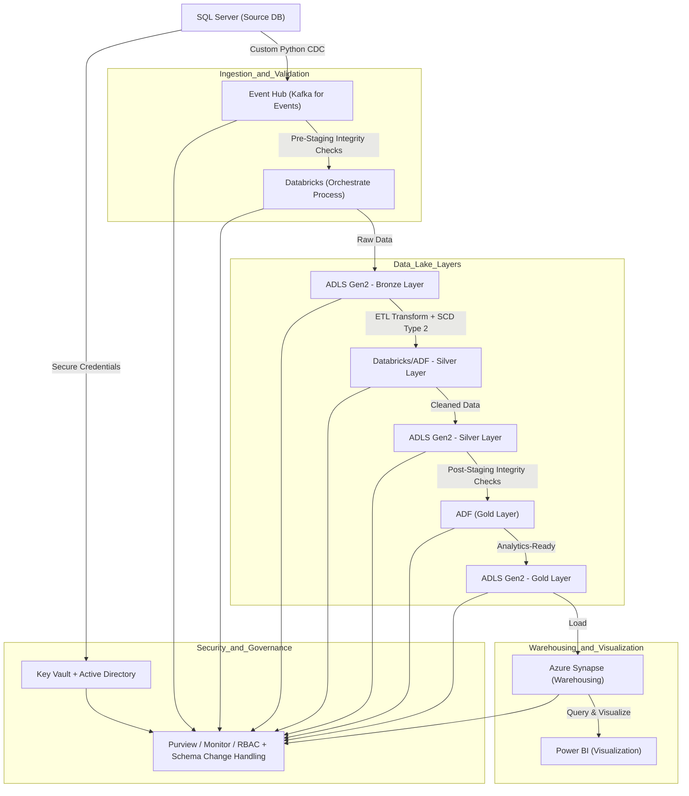

# Maplewood General Hospital - Azure Data Warehouse Pipeline

## Project Description
This project demonstrates a **production-like, end-to-end clinical data warehouse pipeline on Microsoft Azure**.  
It simulates **clinical registry data (FHIR + CSV)**, ingests it into a **data lake (ADLS Gen2)**, processes and normalizes it with **Azure Data Factory + Databricks**, curates data into a **Synapse-based warehouse**, and visualizes insights using **Power BI**.  

The pipeline is designed with **healthcare standards (FHIR, OMOP CDM)** in mind and includes a lightweight **Clinical Decision Support (CDS) demo** inspired by Arden/GEM rules. It also illustrates **governance, de-identification, and security patterns** required for handling sensitive health data.

**Commissioned by:** Maplewood General Hospital - A fictional regional healthcare provider seeking to modernize their data infrastructure for better patient outcomes and operational efficiency.

---

## Global Objective: Addressing Resource Constraints, Patient Flow Inefficiencies, and Rising Costs
Maplewood General Hospital aims to leverage integrated clinical data analytics to tackle critical operational challenges: optimizing limited resources (e.g., beds and staffing), streamlining patient flows across care settings, and controlling escalating healthcare costs through data-driven insights and predictive modeling.

### Specific Objectives by Dataset Focus
- **Bed Capacity and Utilization Optimization** (Trusts, SUS Episodes): Predict occupancy trends, reduce length of stay, and allocate beds efficiently by specialty to address shortages and overcrowding.
- **Emergency Waiting Time Reduction** (ECDS Attendances): Analyze triage categories, treatment delays, and discharge destinations to minimize ED bottlenecks and improve throughput.
- **High-Cost Patient Management** (Patient Journeys, Prescriptions): Identify at-risk patients, optimize prescribing patterns, and track total care costs to prevent readmissions and manage expenses.
- **Care Coordination and Transitions** (MHSDS Referrals, CSDS Contacts, Social Care): Integrate mental health, community services, and social care data to ensure smooth referrals, reduce fragmented care, and enhance patient outcomes.
- **Population Health and Equity Insights** (Patients, Practices): Analyze demographics (e.g., deprivation, ethnicity) and regional data to target preventive care and address access disparities.

---

## Architecture


**Diagram Explanation**: This flowchart visualizes the end-to-end Azure data warehouse pipeline for Maplewood General Hospital. Data flows unidirectionally from the SQL Server source through ingestion, validation, layered storage (Bronze → Silver → Gold), and analytics. Components are grouped into subgraphs for clarity: Ingestion & Validation handles initial data intake; Data Lake Layers manages storage and transforms; Warehousing & Visualization enables querying and BI; Security & Governance provides cross-cutting protection and monitoring. Arrows indicate data movement, with labels showing key processes like CDC, integrity checks, and ETL. *Note: For custom CDC, the Python script (python_cdc.py) can replace Event Hub, capturing deltas via hashing and storing in Blob Storage for ADF to consume.*

## Implementation Steps
1. **Ingestion and Validation**: Set up data sources (SQL Server), Event Hub for streaming, and Databricks for orchestration and pre-staging checks. *Alternative: Use the custom Python CDC script (python_cdc.py) for hash-based delta detection, storing logs in Azure Blob Storage, then integrate with ADF for copying changes to staging.*
2. **Security and Governance**: Implement Key Vault, Active Directory, Purview, Monitor, RBAC, and schema change handling as a foundational layer across all steps.
3. **Data Lake Layers**: Configure ADLS Gen2 Bronze/Silver/Gold layers with Databricks/ADF for ETL transforms, SCD Type 2, and post-staging checks.
4. **Warehouse and Visualization**: Deploy Azure Synapse for warehousing and Power BI for dashboards and analytics.

---
```
```
```
```
